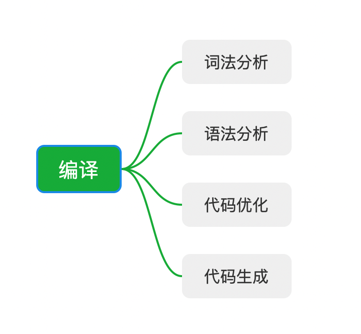
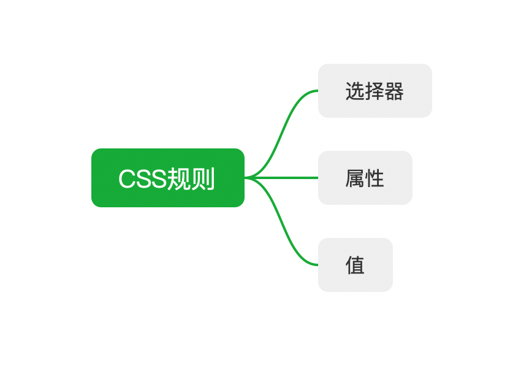
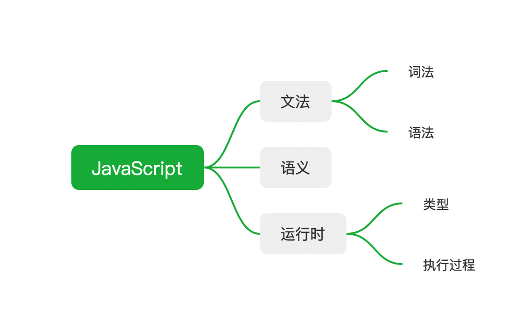
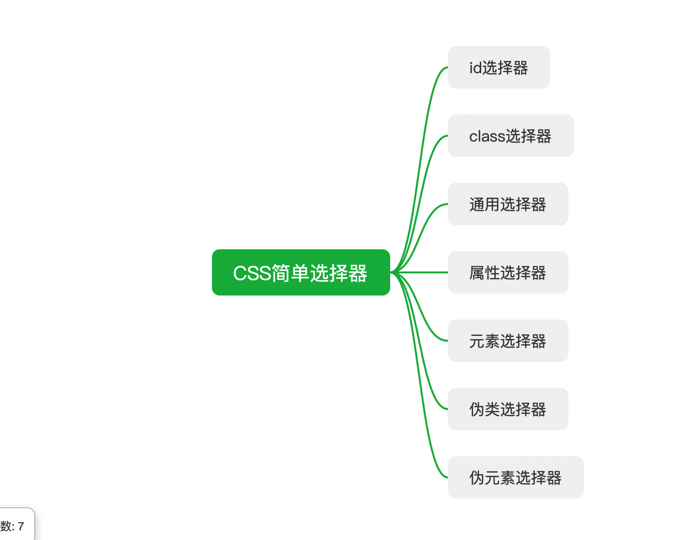

# 每周总结可以写在这里

### 知识体系的建立

第一课 我们学习了知识体系的建立，梳理了前端的知识体系，其实不仅是前端的学习，任何知识的学习都需要建立这样的体系。有了一个完整的知识体系我们才可以做到有的放矢。知识体系就像是一个树的枝干，具体的知识相当于枝干上的叶子。

### 丰富知识体系

知识体系建立后我们需要通过不断迭代将知识的叶子放到枝干上，让知识体系更加茂盛。这时候我们需要使用学习方法。

#### 学习方法

- 整理法
  知识之间是有关联性的，就像索引一样，我们回忆知识的时候是通过这个索引去寻找的
  - 顺序关系
    
  - 组合关系
    
  - 维度关系
    
  - 分类关系
  

- 追溯法
  - 源头
  - 标准和文档
  - 大师

### 检查知识体系

我们需要定期检查知识树上叶子的生长情况，定期摇一摇🌲把有问题的树枝叶子及时处理，保证🌲的健康。

## 作业
- JavaScript的内部类型
  - List and Record 用于描述函数传参过程。
  - Set and Relation 主要用于解释字符集等。
  - Completion Record 用于描述异常、跳出等语句执行过程。
  - Reference 用于描述对象属性访问、delete 等
  - Property Descriptor 用于描述对象的属性。
  - Lexical Environment and Environment Record 用于描述变量和作用域。
  - Data Blocks 用于描述二进制数据。
- [OOP面向对象编程总结](https://chenhaonane.github.io/2020/04/13/OOP%E9%9D%A2%E5%90%91%E5%AF%B9%E8%B1%A1%E7%BC%96%E7%A8%8B/)